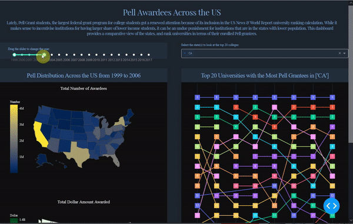

# Pell Award Dashboard using Dash

Pell is the largest financial aid program run by the federal government for the college students. This repository contains the files to pull all the pell award data from the US board of higher education and presents the award distribution across the United States using a Dash application. 

 

  

## Key File Descriptions

### data_process.R

This R script scrapes the [US Department of Education](https://www2.ed.gov/finaid/prof/resources/data/pell-institution.html) to extract all the files about the historical award distributions. Seemingly these files are prepared manually and for human consumption, thus the files are not standardized and contain differently formatted header on top of the report tables.

This script performs following steps to standardize, join and save the final combined verstion of the dataset to be consumed by the application:

* Standardise the shapes of the reports, 
* Standardize the text values eg. name of the institutions,
* Standardise the column names,
* Joins the standardized reports and save the final outcome as 'data/pell_grant_data.csv'.

### app.pell.py

The dash application file.

### Data

This directory contains the raw and processed data. While recreating this app, you can empty this folder and re-running data_process.R should re-populate this folder accordingly.

***

## Document Detail

**Prepared By:** Arafath Hossain
**Created On:** September 14, 2021 
